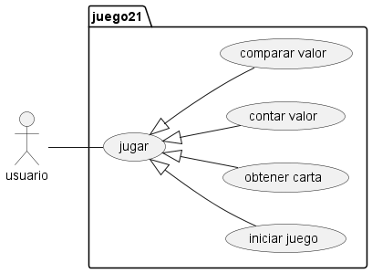

# Ventiuna

el juego de 21 es un juego de cartas, con
una o más barajas permite a dos jugadores
pedir cartas hasta estar lo más próximo al
valor de 21 sin pasarse.

en esta versión simularemos un 21 de un
jugador vs. el repartidor.

el repartidor estara obligado a pedir
cartas hasta igualar al jugardor y solo se 
plantará cuando lo iguale o supere .

El jugador solo podrá ganar si tiene mejor 
puntaje que el repartidor pero sin pasarse
de 21.

las cartas numéricas suman su valor, las
figuras com __"J, Q, K"__ suman 10 y el As 
vale 1 o 11 según convenga, solo puede
valer 11 si con este valor no excede el valor
de 21 de lo contrario solo suma 1.

## diagramas
 - Diagrama e casos de uso:
  
 - Diagrama de clase:
 - Diagrama de secuencia: